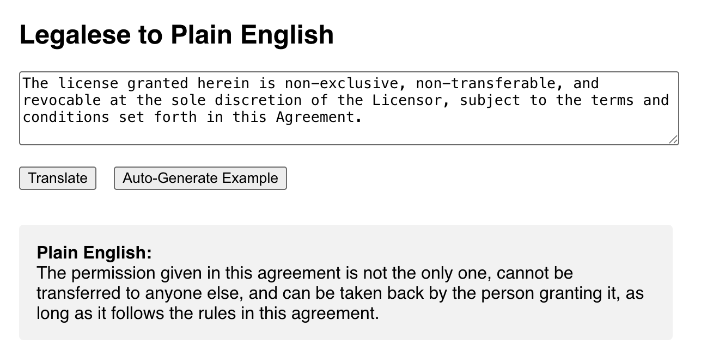

# legal-ease
An AI-powered tool for translating legalese into plain English. Built for legal professionals, developers, and the legally curious.



## Prerequisites

- Python 3.8+
- Node.js & npm
- An OpenAI API key ([get one here](https://platform.openai.com/account/api-keys))

## Backend Setup

1. **Clone the repository:**
   ```bash
   git clone https://github.com/Rob-Kornblum/legal-ease.git
   cd legal-ease
   ```

2. **Create a virtual environment and activate it:**
   ```bash
   python3 -m venv venv
   source venv/bin/activate
   ```

3. **Install Python dependencies:**
   ```bash
   pip install fastapi python-dotenv uvicorn openai pydantic
   ```

4. **Set your OpenAI API key as an environment variable by creating a .env file in the backend directory:**
   ```bash
   OPENAI_API_KEY=sk...
   ```

5. **Run the backend:**
   ```bash
   uvicorn backend.main:app --reload
   ```

## Frontend Setup

1. **Navigate to the frontend directory:**
   ```bash
   cd frontend
   ```

2. **Install frontend dependencies:**
   ```bash
   npm install
   ```

3. **Start the React app:**
   ```bash
   npm start
   ```

   The app will open at [http://localhost:3000](http://localhost:3000).

## Usage

1. Enter a legalese phrase in the text area, **or click "Auto-Generate Example" to fill the input with a random sample legalese phrase.**
2. Click "Translate".
3. View the plain English translation below.

The "Auto-Generate Example" button helps you quickly test the app with realistic legalese

## Troubleshooting

- If you see CORS errors, ensure the backend has CORS middleware enabled for `http://localhost:3000`.
- Make sure both backend and frontend servers are running.